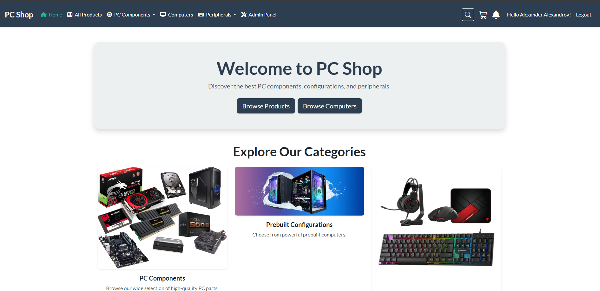
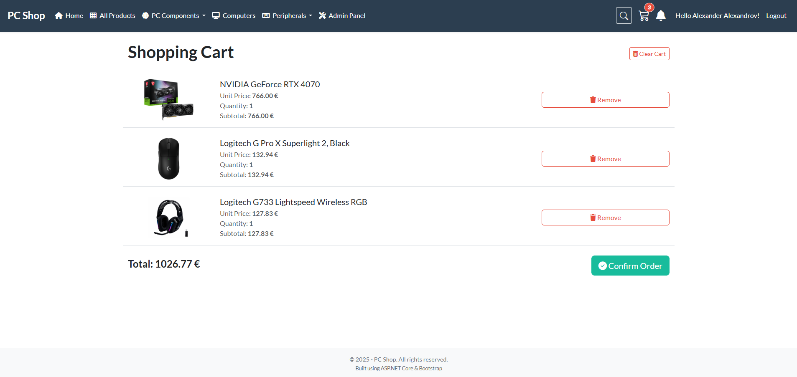
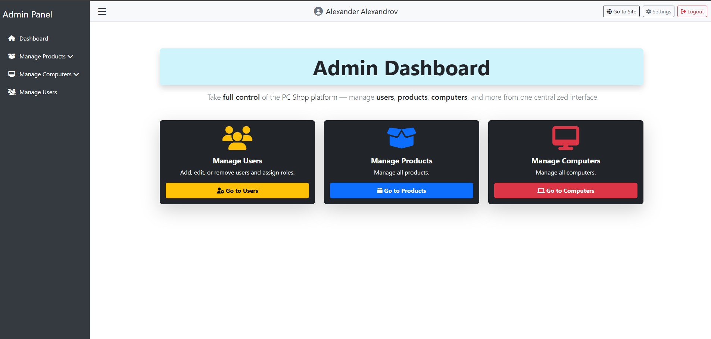

# 🖥️ PCShop - ASP.NET Core E-Commerce

PCShop is a feature-rich e-commerce web application built with **ASP.NET Core**, enabling users to browse, filter, and purchase PC components and computers. It includes user management, shopping cart, order processing, and responsive UI.

---

## ✨ Features

- 🔐 **Authentication & Profile**
- 🛍️ **Product & Computer Catalog**
- 🛒 **Cart & Order Finalization**
- 💳 **Stripe Payments**
- 📤 **Image Upload & Management**
- 📃 **Clean MVC + Service Architecture**
- 🔔 **Notification System** with real-time unread count
- 🗂️ **Admin / Manager / User Areas**

---

## 🖼️ Screenshots

### 🔹 Home Page  


### 🔹 Shopping Cart  


### 🔹 Admin Panel – Home page  


---

## 🧪 Test Credentials
	
- **Admin**: `admin@pcshop.com` / `Admin123!`  
- **Manager**: `manager@pcshop.com` / `Manager123!`  
- **User**: `user@pcshop.com` / `User123!`

### 💳 Stripe Test Card

  * Number: 4242 4242 4242 4242
  * Date: 10/34 (any future date)
  * CVC: 123 (any 3 digits)

---

## 🛠️ Technologies Used

- ASP.NET Core 8 (MVC & Razor Pages)
- Entity Framework Core + SQL Server
- Bootstrap 5 + FontAwesome
- Stripe API (payment)
- Email integration with SMTP
- Repository Pattern & Service Layer
- TempData / Toast Messaging
- Soft Deletes + Admin Restore Panel
- Area-based Role Management

---

## 📂 Project Structure

- `PCShop.Data` – Contains the `DbContext`, repositories, migrations, and seed data
- `PCShop.Data.Models` – Entity models representing database tables
- `PCShop.Data.Common` – Common validation constants for entities
- `PCShop.Services.Core` – Core business logic and service interfaces/implementations
- `PCShop.Services.Common` – Shared constants used across services
- `PCShop.Web` – Presentation layer (MVC controllers, Razor views, and startup config)
- `PCShop.Web.Infrastructure` – TagHelpers, middleware, extensions, and settings
- `PCShop.Web.ViewModels` – ViewModels used for data transfer between views and controllers
- `PCShop.GCommon` – Global constants, enums, and shared validation logic
- `PCShop.Tests` – Unit tests using NUnit and Moq
- `screenshots` - 📸 Screenshots used in README
- `README.md` - project documentation

---

## 🚀 How to Run the Project

1. Clone the repository:
   ```bash
   git clone https://github.com/Alexandr0w/PCShop.git
   ```

2. Navigate to the project directory:
   ```bash
   cd PCShop
   ```

3. Restore dependencies:
   ```bash
   dotnet restore
   ```

4. Run the application:
   ```bash
   dotnet run
   ```

5. Open your browser and navigate to:
   ```
   http://localhost:{localPort}
   ```

---

## 📜 License

This project is licensed under the MIT License. See the [LICENSE](LICENSE) file for details.

---

Enjoy exploring the **PCShop** project! 🖥️